= Management Console
:idprefix:
:idseparator: -
:docinfo: shared
:experimental:

{project-name-full} is powered by http://hawt.io[Hawt.io]. It ships by default in Apache Artemis.

Its purpose is to expose the Apache Artemis https://artemis.apache.org/components/artemis/documentation/latest/management.html[Management API] via a user-friendly web interface.

== Deploying

The web console can be run within Apache Artemis or deployed into a standalone servlet container.

=== Deploying embedded in Artemis

By default, the console is integrated into Apache Artemis.
Refer to the https://artemis.apache.org/components/artemis/documentation/latest/management-console.html#login[Apache Artemis documentation] for how to login.
Once logged in, check out how to <<#using-the-console,use the console>>.

=== Deploying in Jetty

Install https://jetty.org/download.html[Jetty 12] and make sure to add the modules `http` and `ee10-deploy`.
See the
https://jetty.org/docs/jetty/12/operations-guide/deploy/index.html[Jetty Deploy Guide] for more info.

You will need to create a Jetty Context XML file in the `webapps` directory.
Name it `artemis-console.xml` and add the following:

[,xml]
----
<?xml version="1.0" encoding="UTF-8"?>
<!DOCTYPE Configure PUBLIC "-//Jetty//Configure//EN" "https://jetty.org/configure_10_0.dtd">

<Configure class="org.eclipse.jetty.ee10.webapp.WebAppContext">
  <Set name="contextPath">/console</Set>
  <Set name="war">/myapps/artemis-console-war.war</Set>
</Configure>
----

You can then start Jetty using the following command:

[,console]
----
$ java -Dhawtio.authenticationEnabled=false -jar $JETTY_HOME/start.jar
----

NOTE: Since this is only running the Connect plugin Hawtio authentication is disabled. Authentication will take place on connection to the Artemis Broker.

Connect a browser to http://localhost:8080/console or the URL you configured for Jetty.

The <<#connecting-to-a-broker,connecting>> section explains how to connect to a running broker.

For full information on deploying applications in Jetty see https://jetty.org/docs/jetty/12/operations-guide/index.html[The Operations Guide]

=== Deploying in Tomcat

Firstly you will need to install https://tomcat.apache.org/download-10.cgi[Tomcat Version 10].

There are many ways to deploy a *WAR* file using Tomcat. The https://tomcat.apache.org/tomcat-10.1-doc[Tomcat Documentation] explains this in detail.

You will need to make sure  that the context path for the console is configured to be `/console`, if the war were configured in
the tomcat `server.xml` this would look like:

[,xml]
----
<Context path="/console" docBase="/myapps/artemis-console-war.war"/>
----

Since the console only deploys the `connect` plugin authentication by hawtio is done on connecting to the Artemis Broker
you can disable authentication by setting the property:

[,console]
----
export CATALINA_OPTS="-Dhawtio.authenticationEnabled=false"
----

Once Tomcat is started connect a browser to http://localhost:8080/console or the URL you configured for tomcat.

The <<#connecting-to-a-broker,connecting>> section explains how to connect to a running broker.

=== Running from the Command Line (JBang)

You can install and run Hawtio from the command line using JBang.
If you don’t have JBang locally yet, first install it following: https://www.jbang.dev/download/.

Now you can install the latest Hawtio on your machine using the https://www.jbang.dev/[jbang] command:

[,console]
----
$ jbang app install hawtio@hawtio/hawtio
----

This will allow you to deploy Artemis Console using the following command:

[,console]
----
$ hawtio --war-location /pathto/artemis-console-war.war --context-path /console
----

The command will automatically open the console at http://localhost:8080/console/.

For a full list of configuration options run:

[,console]
----
$ hawtio --help
----

== Connecting to a Broker

=== Adding A Connection

Once you have navigated to the *Connect* view click kbd:[Add connection] and fill in the Jolokia endpoint configuration
of your broker.

The endpoint details will depend on your specific broker configuration, but can be easily found in a message printed to
the console during broker startup. For instance, a fresh broker instance displaying startup message:

----
AMQ241002: Artemis Jolokia REST API available at http://localhost:8161/console/jolokia
----

Would yield connection details of:

----
Host: localhost
Port: 8161
Path: /console/jolokia
----

Configure these as needed for your specific broker instance.
You can test the connection with kbd:[Test Connection] before clicking *Add* to save the connection:

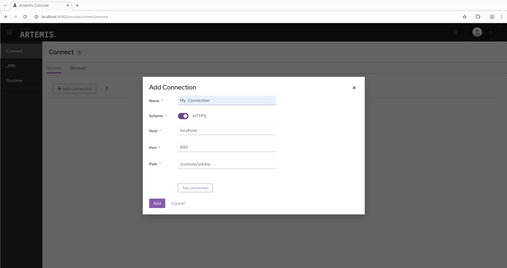

Once the connection is added simply click kbd:[Connect] for your broker and this should open up a new tab and prompt for a login attempt.

== Using the Console

Once logged in you should be presented with a screen similar to:

image::images/console-artemis-plugin.png[Apache Artemis Console Artemis Plugin]

=== Utility Menu

On the top right is a small menu area where you will see some icons:

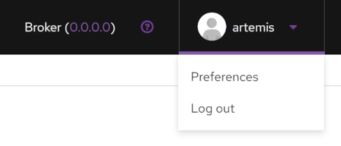

* `?` (question mark) A drop-down menu with:
** `Help` The console user guide
** `About` A screen displaying version number for the various components that comprise the web console
* `<username>` A drop-down menu with:
** `Preferences` Open the preference page for the current user
** `Log out` self descriptive.

=== Management Views

On the left you will see menu items to switch between the various management views.
The first two are specific to the broker.
The rest of this document will focus on these two views.

Use the `☰` icon in the top left to show or hide this menu.

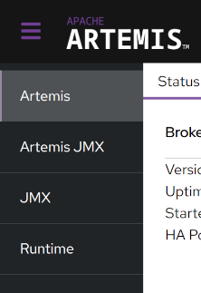

Artemis:: A tabbed view containing paged detailes about various broker resources like addresses, queues, connections, etc.
The most common management operations for the corresponding resource are available on this view.
Artemis JMX:: A tree view allowing access to all the JMX MBeans registered by the broker.
_Every_ management operation and attribute is available in this view.
JMX:: A tree view allowing access to all the JMX MBeans registered in the JVM, not just ones registered by the broker.
Runtime:: A tabbed view containing information about system properties, metrics about system load, and thread details.

In previous versions there was a "Connect" tab which could be used to connect to a remote broker from the same console.
This was disabled by default for security purposes, but it can be enabled again by removing `-Dhawtio.disableProxy=true` from `artemis.profile` (or `artemis.profile.cmd` on Windows).

You can install further Hawtio plugins if you wish to have further functionality.

=== Artemis View

Click the kbd:[Artemis] item in the left navigation bar to open the Artemis view.
(The Artemis item is not present if there is no broker in this JVM).

The following functionality is available on every data table:

Configurable Columns::
The columns displayed are configurable via kbd:[Manage Columns].
This is persisted in the web session's local storage and available when a new session is started.

Ordered Rows::
Data can be ordered by clicking on the sort icon on the top left toolbar, selecting the column to sort, and choosing either ascending or descending or by clicking kbd:[↑] or kbd:[↓].

Searchable::
Data can also be filtered by a value in a particular column by selecting the column and operator from the dropdowns and entering a value to search for.

Contextual Operations::
At the end of most rows is a kbd:[⋮] which can be clicked to show a menu of contextual operations for that particular resource.

==== Status Tab

The Status tab is the default tab shown after login and shows the basic state of the broker, including uptime, the address memory used, and the type of broker deployed.
It also shows the status of each acceptor configured as well as the network status is a cluster of brokers.
This status refreshes every 5 seconds.

==== Connections Tab

The Connections tab lists all the connection to the broker.

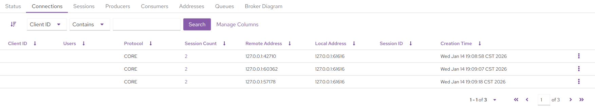

Clicking on the `Session Count` _value_ will navigate to the Sessions tab and automatically filter on the chosen connection.

Contextual Operations in kbd:[⋮]

* kbd:[Close]

==== Sessions Tab

The Sessions tab will list all the session open on the broker.

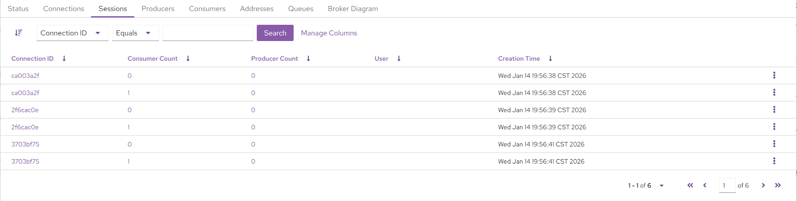

Clicking on the `Connection ID` _value_ will automatically navigate to the Connections tab and filter on that connection.

Clicking on the `Consumer Count` _value_ will automatically navigate to the Consumers tab and filter on the consumer chosen.

Clicking on the `Producer Count` _value_ will automatically navigate to the Producers tab and filter on the producer chosen.

Contextual Operations in kbd:[⋮]

* kbd:[Close]

==== Producers Tab

The Producers tab will list all the producers open on the broker.

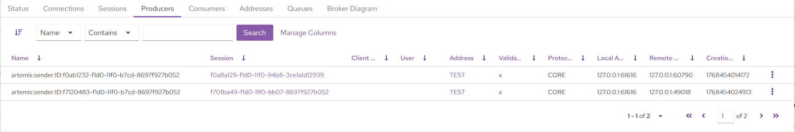

Clicking on the `Session` value will navigate to the Sessions tab and filter on the session chosen.

Clicking on the `Address` value will navigate to the Address tab and filter on that address

==== Consumers Tab

The Consumers tab will list all the Consumers open on the broker.

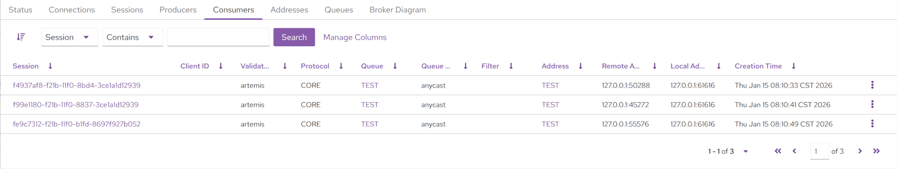

Clicking on the `Session` value will navigate to the Sessions tab and filter on the session chosen.

Clicking on the `Address` value will navigate to the Address tab and filter on that address

Clicking on the `Queue` value will navigate to the Queue tab and filter on that queue

Contextual Operations in kbd:[⋮]

* kbd:[Close]

==== Addresses Tab

The Addresses tab will list all the addresses on the broker.

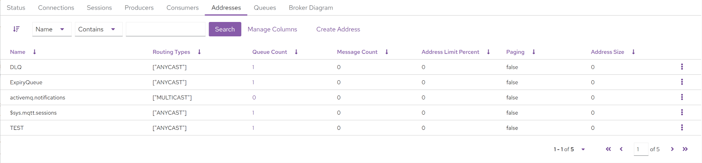

To create a new address click kbd:[Create Address] and fill in the form presented.

Clicking on the `Queue Count` value will navigate to the Queues tab and filter on those queues.

Contextual Operations in kbd:[⋮]

* kbd:[Show in Artemis JMX] - Navigate to the Artemis JMX view and automatically select the addresses MBean.
* kbd:[Attributes] - Show all the address MBean attributes and allow editing if permissions allow.
* kbd:[Operations] - Show all the address MBean operations and allow execution of permissions allow.
* kbd:[Delete Address] - Confirm deletion of the address if permissions allow.
* kbd:[Send Message] - Send a message to this queue if permissions allow.
This in turn will route it to any queues that are bound to this address.
Both headers and a body can be added. The message type is always _text_.

NOTE: Sending will be authenticated using the _current user_.
Unselect the current logged in user to specify a different user.

* kbd:[Create Queue] - Open up a dialog which will allow the user to create queues that are bound to the corresponding address.
A subset of queue parameters are available for direct configuration.
However, parameters not exposed can be configured using a set of key/value pairs, for instance `delay-before-dispatch` or `auto-delete`.

==== Queues Tab

The Queues tab will list all the queues on the broker.

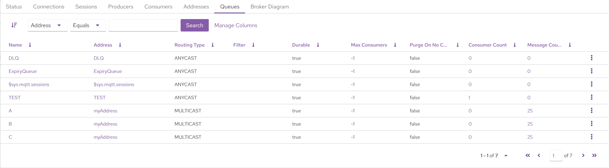

Clicking on the `Address` value will navigate to the Addresses tab and filter on the address chosen.

Clicking on the `Consumer Count` value will navigate to the Consumers tab and filter on the queue chosen.

Clicking on the `Message Count` value will show a different view allowing the user to <<#browsing-messages,browse messages>>.

Contextual Operations in kbd:[⋮]

* kbd:[Show in Artemis JMX] - Navigate to the Artemis JMX view and automatically select the queue MBean.
* kbd:[Attributes] - Show all the queue MBean attributes and allow editing if permissions allow.
* kbd:[Operations] - Show all the queue MBean operations and allow execution of permissions allow.
* kbd:[Send Message] - Send a message to this queue if permissions allow.
This in turn will route it to any queues that are bound to this address.
Both headers and a body can be added. The message type is always _text_.

NOTE: Sending will be authenticated using the _current user_.
Unselect the current logged in user to specify a different user.

* kbd:[Purge] - Remove *all* messages from the queue if permissions allow.
* kbd:[Browse] - Details <<#browsing-messages,here>>.
* kbd:[Delete] - Confirm deletion of the queue if permissions allow.

===== Browsing Messages

Users can view a paginated list of the messages on a queue.
Messages can be filtered, deleted, moved, copied, and resent.
Although there may be a large number of messages in the queue the console only fetches a single page at a time from the broker.
The console will retrieve each page of messages afresh when the list is iterated over or the order or filters are changed.

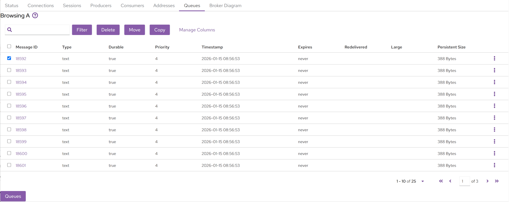

====== Filtering

Messages can be filtered using the JMS Message Selector Syntax as described xref:filter-expressions.adoc#filter-expressions[here].
For example, if you wanted to filter on messages that contained the Message Header myheader which was set to octopus, you would enter `myheader=’octopus’` in the text box in the top left and click kbd:[Filter].

====== Deleting

Messages can be deleted in bulk by selecting the relevant checkbox of each message on the left hand side and clicking kbd:[Delete].
This will open up a dialog box to confirm deletion.
Note that this operation cannot be undone.

NOTE: Messages can also be individually deleted by using the contextual operation in kbd:[⋮].

====== Moving

Messages can be moved in bulk to another queue by selecting the relevant checkbox of each message on the left hand side and clicking kbd:[Move].
This will open up a dialog box that has a searchable drop down box for easy searching of available target queues.
Start typing the name of the queue to which you want to move the messages.

Moving a message removes it from the source queue and adds it to the target queue.
This operation cannot be undone.

====== Copying

Messages can be moved in bulk to another queue by selecting the relevant checkbox of each message on the left hand side and clicking kbd:[Copy].
This will open up a dialog box that has a searchable drop down box for easy searching of available target queues.
Start typing the name of the queue to which you want to move the messages.

Copying a message does _not_ remove it from the source queue.
It simply adds it to the target queue.
This operation cannot be undone.

====== Resending

Messages can be __re__sent to the original address by using the contextual operation in kbd:[⋮].
This will open up a dialog that allows you to send a _new_ message _initialized with the details of the selected message_.

This operation allows the user to change the details of the message if necessary (e.g. body, properties, user, etc.).
It's not necessarily a strict _copy_ of the message.

====== Detailed Viewing

It's possible to get a detailed view of a single message by clicking on the `Message ID` value or by using the contextual operation in kbd:[⋮].
Details include the body of the message (insofar as it can be deserialized), message properties, and message headers.

==== Broker Diagram

The Broker Diagram tab shows a visual representation of the broker, its addresses & queues, and any other broker that may be in the cluster.
You can choose which nodes to show by clicking on kbd:[Node Options].

Clicking on the node will also fetch up the attributes of the associated MBean.

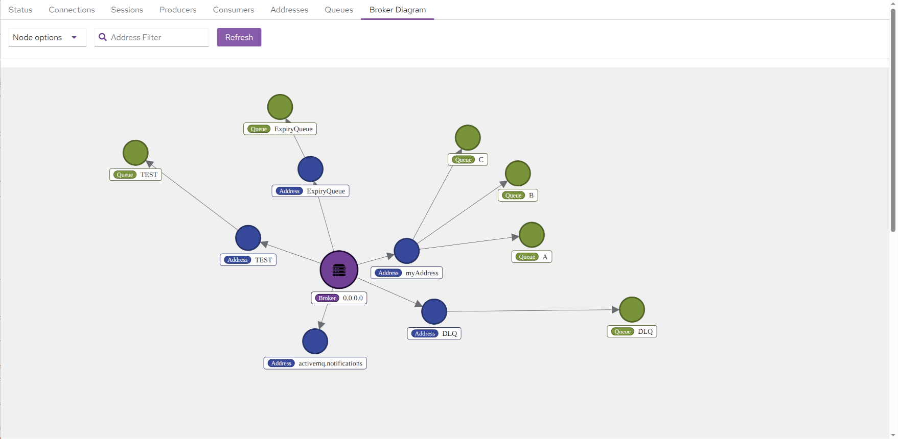

=== Artemis JMX View

Click the kbd:[Artemis JMX] item in the left navigation bar to see the Artemis JMX view.
(The Artemis JMX item is not present if there is no broker in this JVM).
The Artemis JMX view is similar to the standard JMX view, however with a focus on interacting with an Artemis broker.

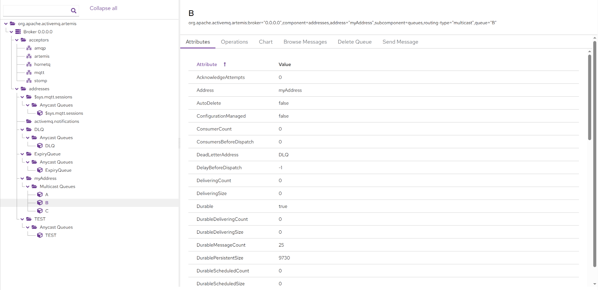

Aside from MBean attributes and operations other tabs are also available based on what kind of resource is being viewed:

* Address
** Create Queue
** Delete Address
** Send Message
* Queue
** Browse Messages
** Delete Queue
** Send Message
